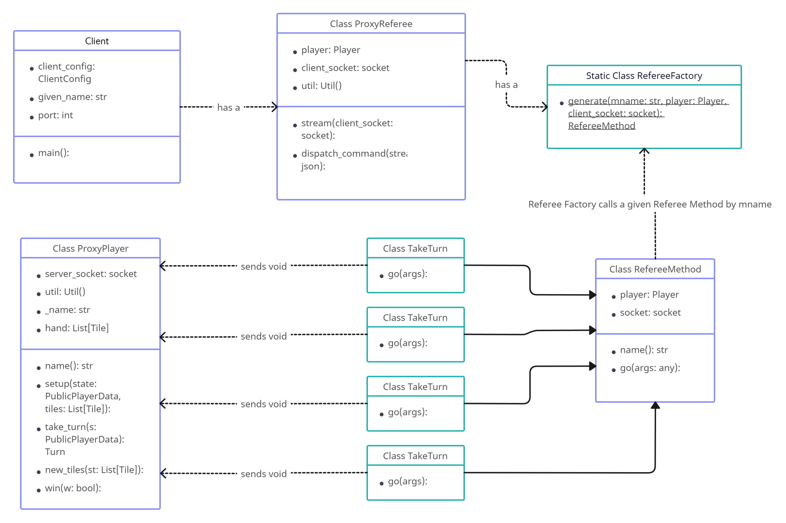
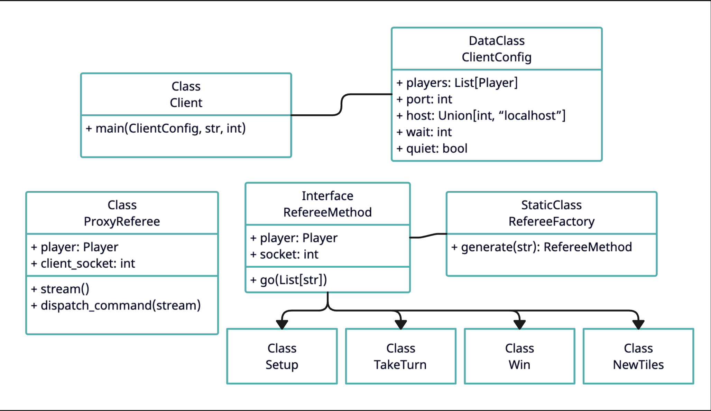
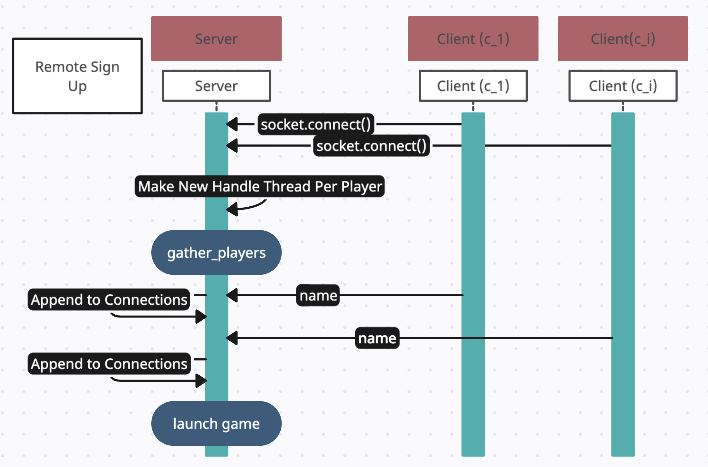
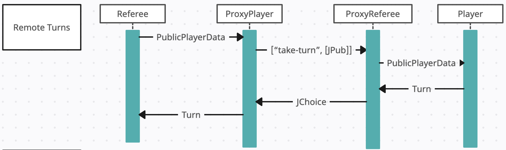
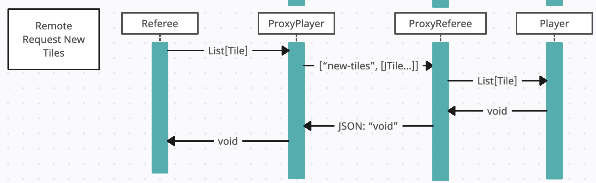
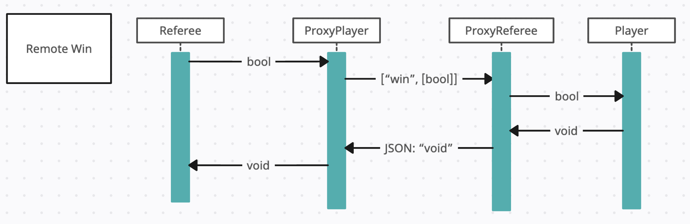

# Client

 
This is the interaction diagram for the client side of the remote proxy design. The client hosts
a proxy referee which continuously listens for jsons to be dispatched. When a json is dispatched
the mname is parsed and the RefereeFactory calls for the appropriate RefereeMethod. Those methods
send void to the ProxyPlayer when complete.

