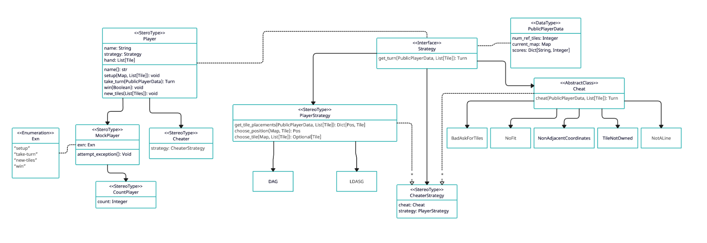
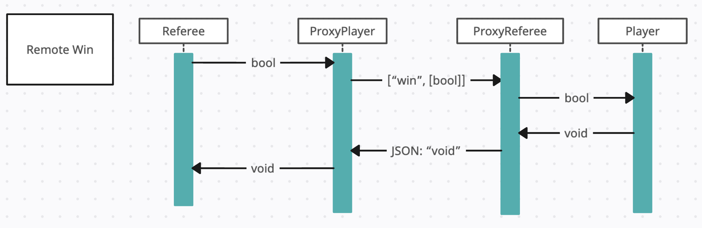
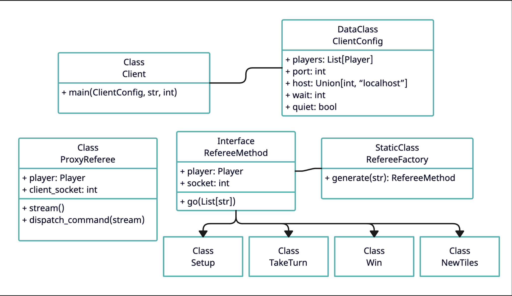
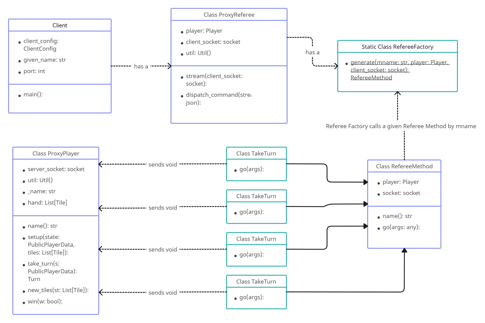

Software Development (CS4500) project at Northeastern University. The requirements are listed on the course <a href="https://course.ccs.neu.edu/cs4500f23/">website</a> under 'Project Milestones'.

<b>To host a server</b>: ./xserver port# < Tests/n-server-config

<b>To connect multiple clients</b>: ./xclients port# < Tests/n-client-config

<b>All UML Diagrams:</b>

Common

Player

Remote Signup Interaction

Remote Turns Interaction

Remote Request New Tiles Interaction

Remote Setup Interaction

Remote Win Interaction

Client Class

Client Interaction

