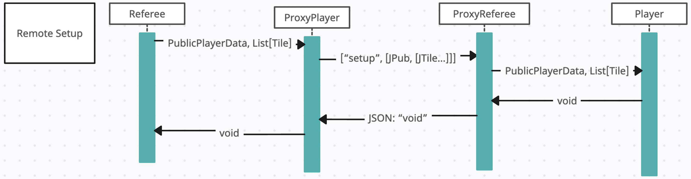

Software Development (CS4500) project at Northeastern University. The requirements are listed on the course <a href="https://course.ccs.neu.edu/cs4500f23/">website</a> under 'Project Milestones'.

<b>To host a server</b>: ./xserver port# < Tests/n-server-config

<b>To connect multiple clients</b>: ./xclients port# < Tests/n-client-config

UML Diagram of Q Players:

