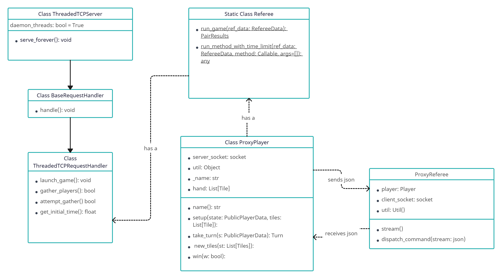
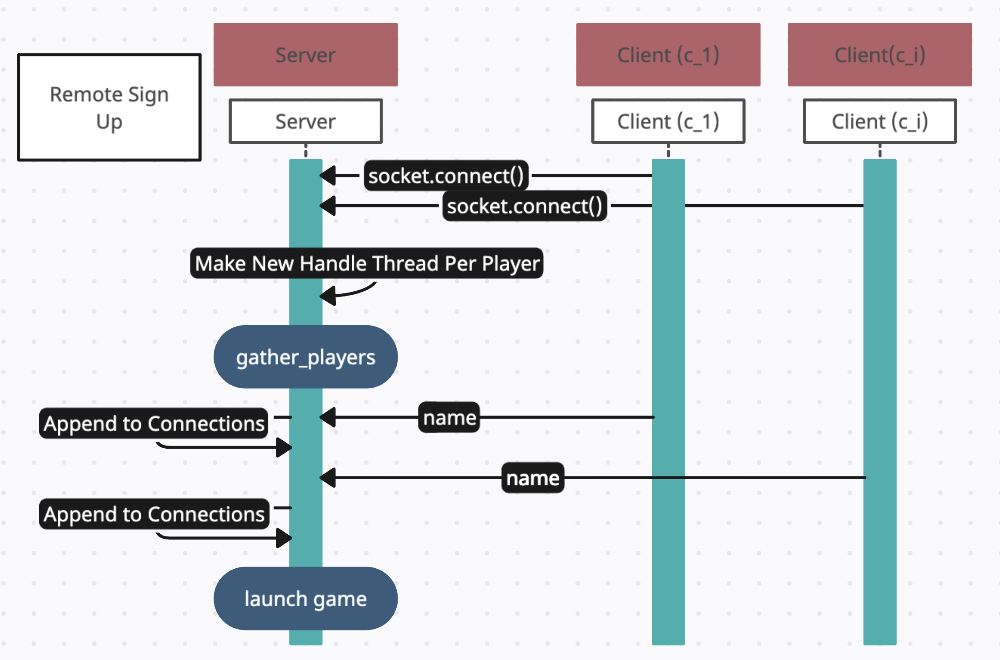
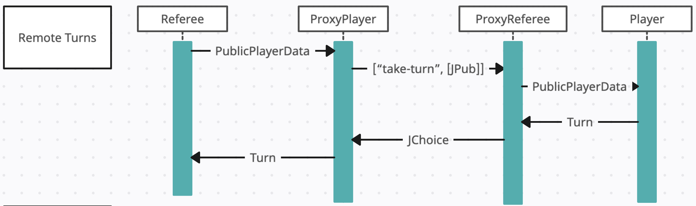
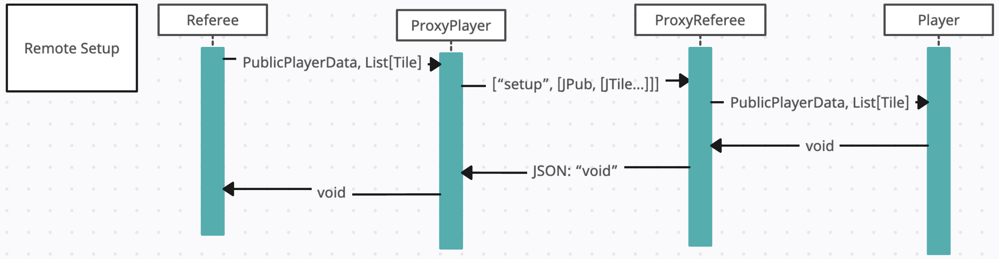

# Server

 
This is the interaction diagram for the server side of our remote proxy. Per each
client connection, a thread is created that waits for the signup period and attempts to launch
the game. Although there are multiple threads being run, we lock the launch_game method
and ensure that only one game is ever ran by the referee.
 
The Referee is passed proxy players that send and receive json information to/from the client.
When we receive information from the client, we parse it using our util methods and return it as
our own data representation to the referee.

